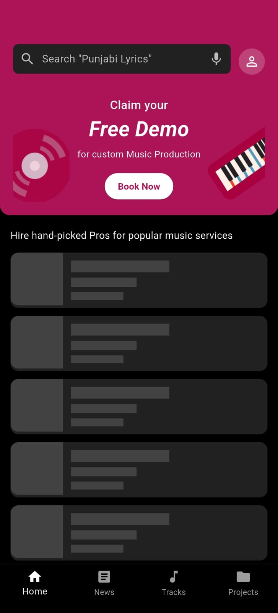
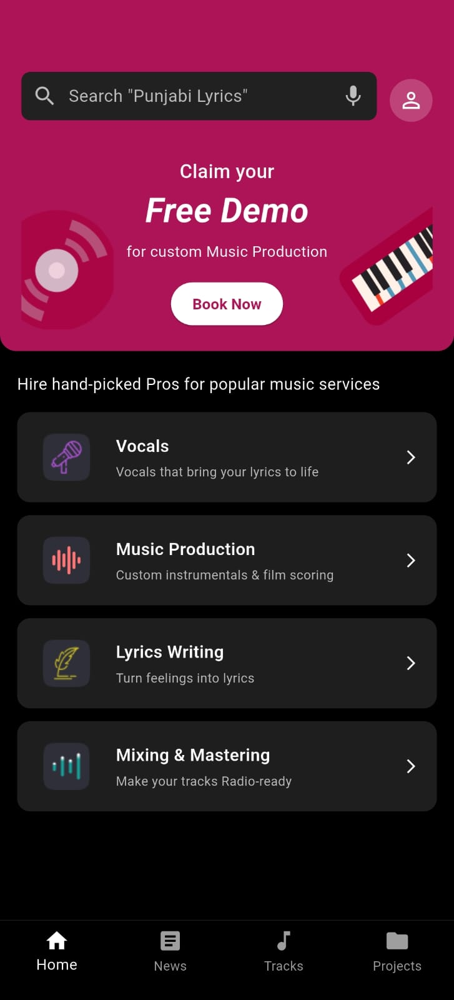
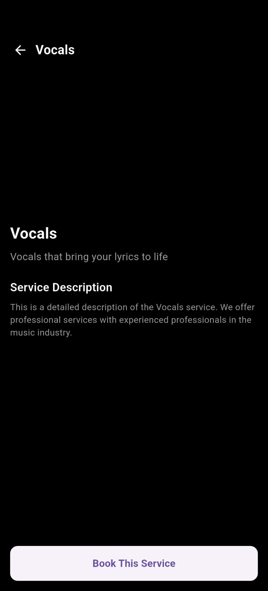

# Music App Assignment

A modern Flutter music player application that delivers a seamless and visually appealing music streaming experience. The app features an intuitive interface, playlist management, and a robust audio player.

## Features

- Browse and play songs from a curated library
- Create and manage playlists
- Add songs to favorites
- Search for tracks, albums, or artists
- Responsive and attractive UI
- Smooth audio playback with controls (play, pause, skip, repeat)

## Screenshots

Below are some UI screenshots of the app:

| Home Screen | Player Screen | Playlist Screen |
|-------------|--------------|----------------|
|  |  |  |

> _Screenshots are located in `assets/screenshots/`._

## Demo Video

Watch the full demo of the app on Google Drive:  
[View Demo Video](https://drive.google.com/file/d/1PbsJNzFaXF_O94WEohUrLquYHYqm_CwO/view?usp=sharing)

## Getting Started

To run this project:

1. **Clone the repository:**
    ```
    git clone https://github.com/nayankeote-2004/Music-App
    cd music_app_assignment
    ```

2. **Install dependencies:**
    ```
    flutter pub get
    ```

3. **Run the app:**
    ```
    flutter run
    ```

## Requirements

- Flutter SDK (latest stable)
- Dart SDK
- Android Studio or VS Code (recommended)

## License

This project is licensed under the MIT License.

---